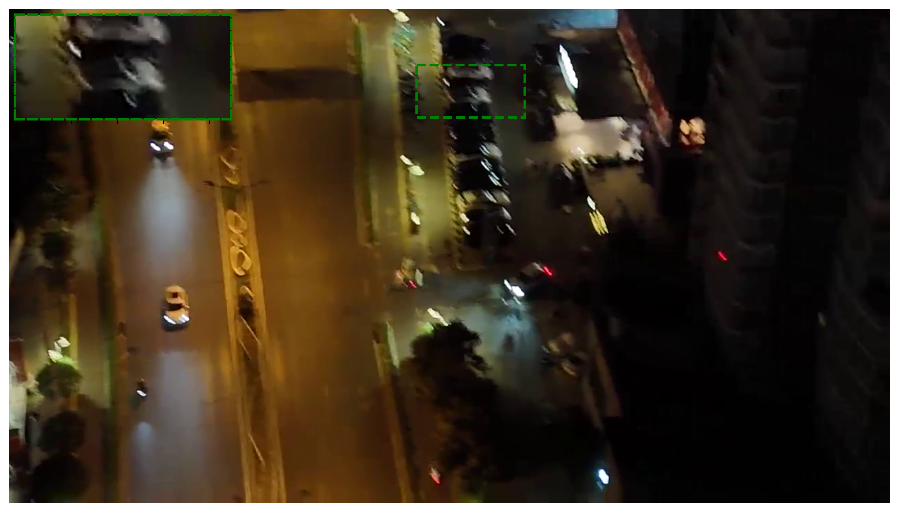
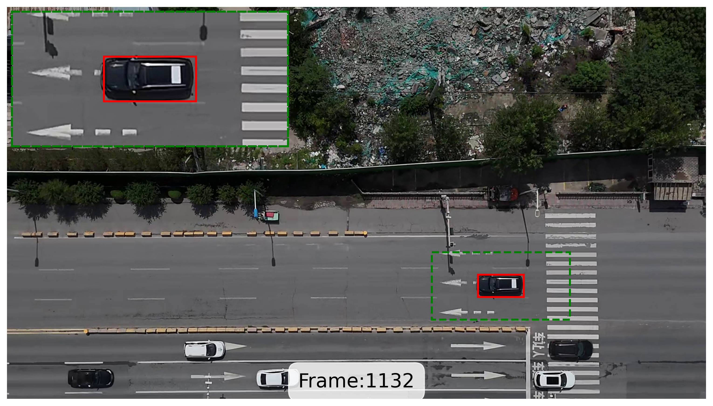
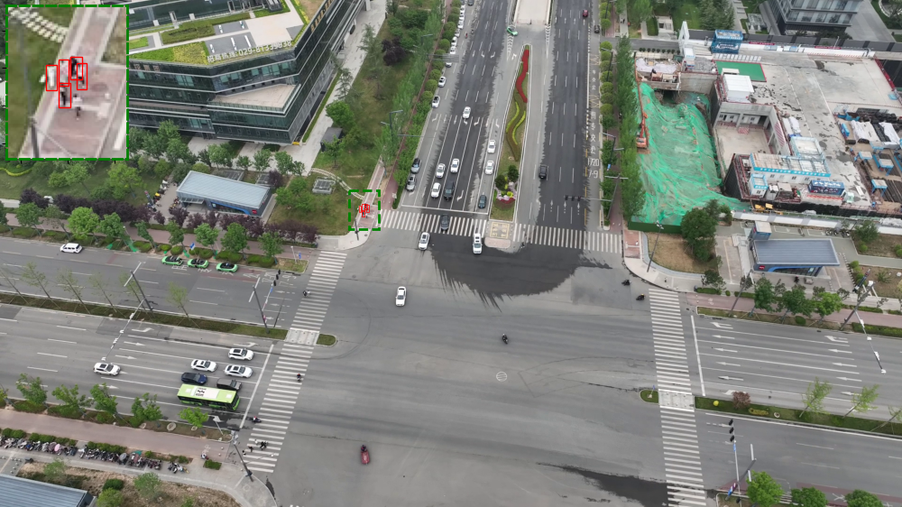

# DynUAV
This repository contains the source code for the statistical analysis of the challenging characteristics of the DynUAV dataset.

## Dataset
### Overview
DynUAV is a UAV-perspective MOT benchmark designed to evaluate tracking robustness under aggressive camera motion. Unlike ground-view scenarios, aerial platforms introduce large viewpoint variations, rapid ego-motion, and abrupt inter-frame displacement.

#### Representative Scenarios

1. Viewpoint Transition under UAV Maneuver
   
<div align="center">
<!-- 图片组整体居中 -->
<div style="display: flex; justify-content: center; gap: 20px; flex-wrap: wrap;">
    <div style="text-align: center;">
        
        
        
    </div>
</div>
<em>Figure 1: Continuous viewpoint transition caused by aggressive yaw/pitch maneuvers.</em>
</div>

2. Motion Blur under Rapid Turning
   
<div align="center">
   
   <br/>
   <em>Figure 2: Severe motion blur induced by abrupt camera rotation.</em>
</div>

3. Fast inter-frame displacement

<div align="center">
<!-- 图片组整体居中 -->
<div style="display: flex; justify-content: center; gap: 20px; flex-wrap: wrap;">
    <div style="text-align: center;">
        
        
    </div>
</div>
<em>Figure 3: Large inter-frame displacement under high-speed UAV motion.</em>
</div>
   
4. Long-term trajectory interruption

<div align="center">
<!-- 图片组整体居中 -->
<div style="display: flex; justify-content: center; gap: 20px; flex-wrap: wrap;">
    <div style="text-align: center;">
        
        
    </div>
</div>
<em>Figure 4: Target disappearance and long-term re-entry across distant frames.</em>
</div>
   
5. Scale variation caused by altitude change

<div align="center">
<!-- 图片组整体居中 -->
<div style="display: flex; justify-content: center; gap: 20px; flex-wrap: wrap;">
    <div style="text-align: center;">
        
        
    </div>
</div>
<em>Figure 5: Rapid scale variation due to altitude and viewpoint change.</em>
</div>
   
6. Multi-object interaction under dynamic motion

<div align="center">
   
   <br/>
   <em>Figure 2: Severe motion blur induced by abrupt camera rotation.</em>
</div>

#### Dataset Scale
* **42** video sequences
* **37893** annotated frames
* **1747618** total object instances
* Resolutions up to **1920×1080**
* Official **train / val / test** splits

#### Design Focus
While existing UAV benchmarks often emphasize detection under small-object or low-resolution conditions, 
DynUAV highlights long-term association robustness under complex ego-motion and maneuver-induced viewpoint changes.
   
### Dataset Structure
```
DynUAV-I/
├── videos/  # Original video files (.mp4)
├── img_annos/
|  ├── train/
|  ├── val/
|  ├── test/
```
Each sequence folder under ```train/val/test``` follows the MOTChallenge-style format:
```
<sequence_name>/
├── img1/            # Extracted image frames
├── gt/     
|   └── gt.txt       # Ground-truth annotations
├── det/
|   └── det.txt      # Public detection results
└── seqinfo.ini      # Sequence metadata
```
### Annotation Format
DynUAV follows the standard MOTChallenge annotation format.

#### Ground Truth (```gt.txt```)
Each line corresponds to one object instance in one frame. 
All annotations are frame-based, while the order of `frame_id` and `object_id` may vary across different sequences.
Users are advised to read the first two fields dynamically when parsing the annotations.
Each entry contains the following fields:
```
frame_id/object_id, object_id/frame_id, x, y, width, height, conf, class, visibility, unused
```
* ```(x,y)```denotes the top-left coordinate of the bounding box.
* Bounding boxes are defined in pixel coordinates.
* The remaining fields follow MOTChallenge conventions.

#### Detection File (```det.txt```)
Detection entries follow the same bounding box format, with object_id = -1 and conf indicating detection confidence.

#### Sequence Metadata (```seqinfo.ini```)
Contains sequence-level information such as:
* Frame rate
* Sequence length
* Image resolution

## For Code
### Environmental requirements
The statistical analysis scripts were tested under the following environment:
* matplotlib 3.10.0
* python 3.12.9
* numpy 2.0.1
* opencv-python 4.11.0.86
* pandas 2.2.3

These scripts are lightweight and do not require a dedicated conda environment. 
Using the above versions is recommended to ensure reproducibility.

### How to Run
The statistical analysis can be launched via:
#### Command-line Arguments
- `--dataset_name {UAV123, VisDrone, UAVDT, MDMT, MOT20, MOT17, DanceTrack, SportsMOT, DBT70, NAT2021, UAVTrack112, OURS}`  
  Specifies which dataset to analyze.  
  The default value is `OURS` (DynUAV).
- ```--show_process {True/False}```  
  Whether to visualize intermediate results during analysis, including:
  - Sampled annotation visualization
  - Adjacent-frame non-overlap (IoU=0) visualization
  - Object trajectory visualization
Set ```--show_process False``` for faster execution without visualization.

#### Output Statistics
A. Video-level Statistics
 - Sequence length statistics
 - Bar chart of video lengths
 - Histogram of video length distribution

B. Annotation-level Statistics
 - Object density statistics
 - Distribution of object area ratio and aspect ratio
 - Distribution of area ratio and aspect ratio relative to the first appearance (reflecting viewpoint and scale variation)
 - Per-class sample count (each sample corresponds to one object instance per frame)
 - Number of trajectories per video
 - Number of samples per video
 - Distribution of sample counts

C. Trajectory-level Statistics
 - Trajectory interval statistics and distribution
 - Object lifetime statistics, bar chart, and histogram
 - Number of continuous trajectory segments per object
 - Adjacent-frame IoU distribution and statistics
 - Proportion of non-overlapping adjacent frames (IoU = 0)
 - Total displacement per object (sum of adjacent-frame displacements)

### Core Dataset Characteristics
1. Aggressive Maneuver-Induced Motion
DynUAV exhibits severe inter-frame motion caused by UAV maneuvers.
This is quantitatively reflected by:
 * Adjacent-frame IoU statistics
 * Proportion of non-overlapping adjacent frames (IoU = 0)
These metrics collectively characterize motion severity.

2. Long Temporal Span
Objects in DynUAV often reappear after long temporal gaps.
This property is measured using:   
 * Trajectory interval statistics
   
3. Frequent Trajectory Fragmentation
Trajectories are frequently interrupted due to dynamic viewpoint changes and occlusion.
This characteristic is captured by:
 * Number of continuous trajectory segments per object

  

